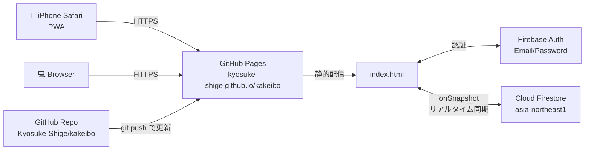
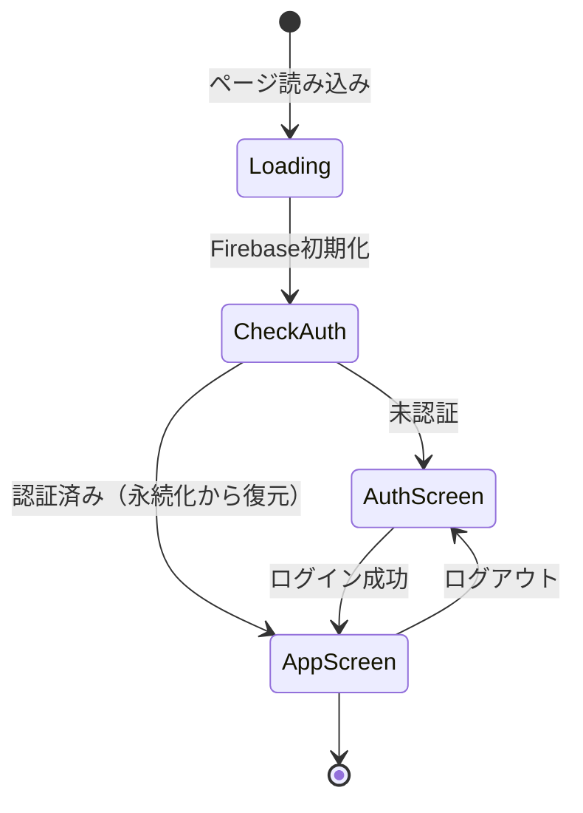

# 家計簿 — 情報アーキテクチャ

二人暮らしの生活費精算アプリ。Webアプリとして実装し、iPhoneのホーム画面から起動して使う。

---

## 1. 概要

| 項目 | 内容 |
|---|---|
| 目的 | 毎月の生活費（食費・電気・ガス・水道）を公平なルールで按分し、履歴を残す |
| ユーザー | 二人暮らしのカップル2名（共有アカウント方式） |
| デバイス | iPhone Safari（ホーム画面PWA）/ デスクトップブラウザ |
| データ共有 | リアルタイム同期（片方が記録すると他方の画面に数秒で反映） |
| データ保持 | クラウド永続（Firestore） + 端末初期化しても消えない |

---

## 2. 技術スタック

| レイヤ | 採用技術 | 選定理由 |
|---|---|---|
| フロントエンド | プレーンHTML + CSS + JS（単一ファイル） | ビルド不要・iOSで直接動く・PWA化容易 |
| 認証 | Firebase Authentication（Email/Password） | 無料枠が実質無制限・実装10行程度 |
| データベース | Cloud Firestore | リアルタイム同期・無料枠余裕・Firebase統合 |
| ホスティング | GitHub Pages（Public Repo） | 無料・独自URL・Git連携で更新即反映 |
| フォント | Shippori Mincho / Noto Sans JP / Inter（Google Fonts） | 和モダン・紙の家計簿の質感 |

**フレームワーク不採用理由**: 二人専用・将来拡張少・ビルド環境のメンテコストを避けるため、単一HTMLで完結する構成を選択。

---

## 3. システム構成図



---

## 4. ホスティング・URL

| 種別 | URL / ID |
|---|---|
| 公開URL | https://kyosuke-shige.github.io/kakeibo/ |
| リポジトリ | https://github.com/Kyosuke-Shige/kakeibo |
| Firebaseプロジェクト | `kakeibo-7b4c4` |
| Firestore リージョン | `asia-northeast1`（東京） |
| 承認済みドメイン | `localhost` / `kakeibo-7b4c4.firebaseapp.com` / `kyosuke-shige.github.io` |

---

## 5. 認証設計

### 方式
**共有アカウント方式**（パスワードを二人で共有する単一Firebaseユーザー）

### 理由
- 二人しか使わないため、ユーザーごとに分ける必要性が低い
- 実装がシンプル（1ユーザー、1パスワード）
- データに "誰が入力したか" の属性が必要になれば後付け可能

### 永続化
`browserLocalPersistence` を使用。初回ログイン後、同一ブラウザではログイン状態が保持される（手動ログアウトするまで）。

### 認証フロー



---

## 6. データモデル（Firestore）

### コレクション構造
```
firestore/
└── entries/  … 月次記録のドキュメント群
    └── {auto-id}/  … 各エントリ
```

### エントリのスキーマ

| フィールド | 型 | 説明 |
|---|---|---|
| `date` | string | 日付 `YYYY-MM-DD`（過去日付入力可） |
| `memo` | string | 任意メモ（空文字可） |
| `food` / `elec` / `gas` / `water` | number | 各費目の総額（入力値） |
| `foodM` / `foodF` | number | 食費の男/女負担額（按分結果） |
| `elecM` / `elecF` | number | 電気代の男/女負担額 |
| `gasM` / `gasF` | number | ガス代の男/女負担額 |
| `waterM` / `waterF` | number | 水道代の男/女負担額 |
| `totalM` / `totalF` | number | 各人の合計負担 |
| `grandTotal` | number | 全体合計（= food + elec + gas + water） |
| `createdAt` | Timestamp | `serverTimestamp()`で記録時刻 |

### クエリ・ソート戦略
```js
// Firestoreからは全件取得（orderByなし = 複合インデックス不要）
const q = collection(db, 'entries');

// クライアント側でソート（date降順 → createdAt降順）
entries.sort((a, b) => {
  const dateCmp = (b.date || '').localeCompare(a.date || '');
  if (dateCmp !== 0) return dateCmp;
  return (b.createdAt?.seconds || 0) - (a.createdAt?.seconds || 0);
});
```

**サーバー側orderByを使わない理由**: Firestoreで2つ以上のフィールドに `orderBy` を指定すると複合インデックスの作成が必須。インデックスが未作成の場合、クエリが静かに失敗し **データが表示されない**バグが発生する（初版で実際に発生）。年間300〜400件規模のデータセットではクライアント側ソートのコストは無視できる（1ms以下）。

**按分結果を保存している理由**: 過去の按分ルール変更時も **当時の計算結果を保持** するため（再計算しない）。

### 表示件数制限（ページネーション）
- 履歴は初期表示 **30件** に制限
- 「もっと見る」ボタンで30件ずつ追加表示
- DOM負荷を抑制（年間365件×5年 = 1,800件を一括描画するとiPhoneで描画遅延のリスク）

---

## 7. 計算ロジック（按分ルール）

| 費目 | ルール | 比率 | 根拠 |
|---|---|---|---|
| **食費** | 体重比 | 男 60 : 女 45（合計105） | 食事量は体重に比例するという仮定 |
| **電気代** | 滞在時間比 | 男 17 : 女 7（合計24h） | 共在 14h を折半（各7h） + 男単独 10h を男負担 → 男 = 7+10 = 17h、女 = 7h |
| **ガス代** | 折半 | 男 1 : 女 1 | 使用頻度に大差なし |
| **水道代** | 折半 | 男 1 : 女 1 | 従量制でなく使用量把握困難 |

### 実装

```js
foodM  = round((60/105) * food)
foodF  = food - foodM             // 残りを女に（端数処理で合計ズレ防止）
elecM  = round((17/24) * elec)
elecF  = elec - elecM
gasM   = round(gas / 2)
gasF   = gas - gasM
waterM = round(water / 2)
waterF = water - waterM
```

**ポイント**: 片方を `round` で計算し、もう片方は `総額 − round結果` で出す。これで合計が必ず元の金額と一致する（1円のズレなし）。

---

## 8. 画面構成

```
家計簿 App
├── Loading View       （認証状態チェック中）
│
├── Auth View          （未認証）
│   ├── Masthead（N°・日付・タイトル）
│   └── Sign in Form
│       ├── Email input
│       ├── Password input
│       └── ログインボタン
│
└── App View           （認証済み）
    ├── Masthead
    ├── Ledger（入力）
    │   ├── Date picker
    │   ├── Memo textarea
    │   ├── 食費 / 電気 / ガス / 水道 入力行（×4）
    │   └── 合計表示
    │
    ├── Results（精算結果 / 入力額>0で表示）
    │   ├── 比率バー（男:女）
    │   ├── Person Card × 2（男 / 女の内訳）
    │   ├── Formula Panel（開閉式の計算式表示）
    │   └── 記録するボタン
    │
    ├── History（記録一覧 / Firestore購読 / 初期30件表示）
    │   ├── Entry × 30（日付・総額・男女負担・費目別・メモ・削除）
    │   └── 「もっと見る」ボタン（30件ずつ追加読込）
    │
    ├── Monthly（月次集計）
    │   ├── Trend Chart（SVG棒グラフ、直近6ヶ月）
    │   └── Month Entry × N（月・合計・男女別・前月比）
    │
    └── Footer
        └── ログアウトリンク
```

---

## 9. 状態フロー

### データ同期フロー
```
[User A 記録] → addDoc(entries) → Firestore
                                      ↓
                                onSnapshot発火
                              ↙              ↘
                     [User A 画面]        [User B 画面]
                      ↓                    ↓
                  クライアント側ソート     クライアント側ソート
                      ↓                    ↓
                  renderHistory()     renderHistory()
                  renderMonthly()     renderMonthly()
```

### エラーハンドリング
`onSnapshot` の購読が失敗した場合（ネットワーク切断・権限エラー等）:
- コンソールにエラーログを出力
- 履歴セクションに「データの取得に失敗しました。ページを再読込してください。」を表示
- ユーザーが沈黙状態で混乱しないように可視化

### 初回ログイン時の自動移行
```
認証成功
  ↓
onAuthStateChanged → user有り
  ↓
subscribeEntries() 開始
  ↓
migrateLocalToCloud() 実行
  ├─ localStorage['billHistory'] を読む
  ├─ Firestore が空か確認
  └─ 空なら全エントリを addDoc で移行
     （localStorage はバックアップとして残す）
```

---

## 10. セキュリティ設計

### 多層防御
| レイヤ | 対策 |
|---|---|
| 認証 | Firebase Auth（Email/Password）必須 |
| 認可 | Firestore Security Rules で `request.auth != null` チェック |
| 通信 | HTTPS強制（GitHub Pages + Firebase） |
| ドメイン | Firebase Auth 承認済みドメインで制限 |

### Firestore Security Rules
```
rules_version = '2';
service cloud.firestore {
  match /databases/{database}/documents {
    match /entries/{entryId} {
      allow read, write: if request.auth != null;
    }
  }
}
```

### 公開情報 vs 非公開情報

| 情報 | 公開状態 | 備考 |
|---|---|---|
| Firebase API Key | ✅ 公開（HTML内・GitHub） | Firebase仕様上、公開しても安全 |
| プロジェクトID | ✅ 公開 | 同上 |
| 按分ロジック・画面コード | ✅ 公開 | 二人の事情（体重等）も含むが公開判断 |
| **ログイン用メール/パスワード** | ❌ **絶対非公開** | これが漏れると第三者がデータ閲覧可能 |
| 記録データ（金額・メモ） | ❌ Firestoreで保護 | 認証ユーザーのみアクセス可 |

---

## 11. ファイル構成（リポジトリ）

```
kakeibo/
├── index.html          … メインアプリ（GitHub Pages ルート、bill-split.html と同一内容）
├── bill-split.html     … 元ファイル名のコピー（互換性維持）
├── .gitignore
└── ARCHITECTURE.md     … このドキュメント（GitHub上でMermaid図が自動レンダリング）
```

**意図的にシンプルな構成**: ビルド成果物なし・依存なし・HTML1ファイルで完結。将来の自分が見ても即理解できる状態を維持。

**注意**: `index.html` と `bill-split.html` は同一内容。コード変更時は両方更新する必要がある（運用ルール: bill-split.html を編集 → cp で index.html に同期 → commit）。

---

## 12. 運用・保守

### 更新フロー
```
コード編集（index.html 等）
  ↓
git commit + push
  ↓
GitHub Pages 自動デプロイ（30秒〜1分）
  ↓
https://kyosuke-shige.github.io/kakeibo/ に反映
```

### Firebase無料枠の実態

想定: 食費は毎日記録 + 月次の光熱費等で **年間300〜400件**、5年で約1,800件。

| リソース | 無料枠上限 | 二人の想定使用量 | 到達率 |
|---|---|---|---|
| Firestore 読み取り | 50,000/日 | 1,800件 × 2人 × 3回起動/日 = ~10,800/日（5年運用後） | 22% |
| Firestore 書き込み | 20,000/日 | ~3件/日（食費 + 月次） | 0.015% |
| Firestore ストレージ | 1GB | ~1MB（5年分・1件約500B） | 0.1% |
| Auth アクティブユーザー | 50,000/月 | 2 | 0.004% |

5年運用後の最悪ケース読み取り量でも **無料枠の22%** に収まる。実質 **永久無料**。

**前提**: `onSnapshot` は初回購読時に全件読み取り、以降は差分のみ。ページ再読込時に毎回全件取得が発生するため、頻繁に再読込しても枠を超えない設計が必要（クライアント側キャッシュは現状未実装）。

### トラブルシュート

| 症状 | 対処 |
|---|---|
| ログインできない | Firebase Console → Authentication → ユーザーが存在するか確認 |
| データが同期しない | ブラウザのコンソールでエラー確認。承認済みドメインチェック |
| 履歴が表示されない | 画面に「データの取得に失敗しました」と出る → ネットワーク確認・再読込。コンソールに `permission-denied` の場合はFirestoreルールを確認 |
| 過去データを復旧したい | Firestoreコンソール → entries コレクション直接閲覧 |
| パスワード忘れた | Firebase Console → Users → ユーザー選択 → パスワードリセット |
| 動作が重い（5年運用後） | 履歴の表示件数を30件に制限済み。「もっと見る」で順次表示。月次集計は全件で計算される |

---

## 13. 設計判断ログ（Why の記録）

過去に検討して採用 or 却下した判断を残し、未来の自分が同じ議論を繰り返さないようにする。

| 判断 | 採用案 | 却下案 | 理由 |
|---|---|---|---|
| Firestore ソート | クライアント側JS（`Array.sort`） | サーバー側 `orderBy` 複合 | 複合インデックス作成必須・ユーザー操作増・初版で実バグ発生。クライアント側は1,800件で1ms以下 |
| 履歴表示件数 | 初期30件 + 「もっと見る」 | 全件一括表示 | DOM負荷・iPhone描画遅延の予防 |
| 認証方式 | 共有1アカウント | 二人別アカウント | 二人専用なので分ける必要なし。権限管理シンプル |
| データスキーマ | 按分結果も保存 | 入力値のみ保存・表示時に再計算 | 将来按分ルール変更時、過去記録の値が変わると履歴の意味が壊れる |
| ホスティング | GitHub Pages（Public） | Cloudflare Pages・Vercel | 既存GitHubアカウントで完結・無料・URL推測困難で実質Private |
| データ取得方式 | `onSnapshot` リアルタイム購読 | 起動時 `getDocs` 1回のみ | 二人で同期する用途のため。書込側の画面に即反映するUXが必須 |
| サブスクの初回読込キャッシュ | 未実装 | 実装 | 5年後でも無料枠22%。複雑性追加に見合わない |

---

## 14. 拡張ポイント

短期で入れる余地があるもの：

| 機能 | 用途 | 実装難度 |
|---|---|---|
| 立替・精算機能 | 「誰が払ったか」記録 → 「A→B ¥X,XXX」の精算指示 | 中 |
| 項目のカスタマイズ | 家賃・サブスク・日用品などの追加 | 中 |
| CSVエクスポート | バックアップ・確定申告用 | 小 |
| PWA完全対応 | manifest.json・サービスワーカー・オフライン動作 | 中 |
| 月初リマインダー通知 | 入力忘れ防止 | 小（Web Push） |
| 領収書写真添付 | Firebase Storage連携 | 中 |

---

## 15. 変更履歴

| 日付 | 変更 |
|---|---|
| 2026-04-16 | 初期実装完了・GitHub Pages公開・Firestore連携 |
| 2026-04-16 | **Bugfix**: Firestoreクエリの複合インデックス問題を修正（`orderBy` 二重指定 → クライアント側ソートに変更）。記録した内容が履歴に表示されないバグを解消 |
| 2026-04-16 | 履歴表示にページネーション追加（初期30件 +「もっと見る」） |
| 2026-04-16 | `onSnapshot` 失敗時のユーザー可視エラー表示追加 |
| 2026-04-16 | ARCHITECTURE.md 作成・GitHub にpush |

---

## 16. 参考URL

- Firebase Console: https://console.firebase.google.com/project/kakeibo-7b4c4/overview
- Firestore コンソール: https://console.firebase.google.com/project/kakeibo-7b4c4/firestore
- Authentication コンソール: https://console.firebase.google.com/project/kakeibo-7b4c4/authentication/users
- GitHub Pages 設定: https://github.com/Kyosuke-Shige/kakeibo/settings/pages
